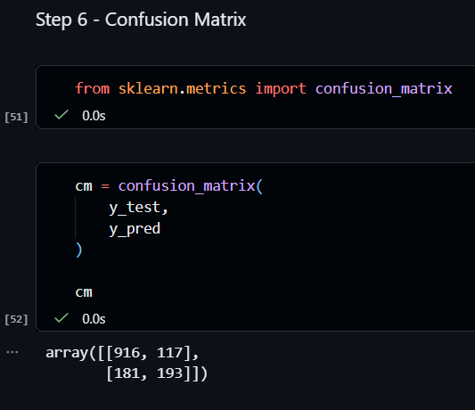

# Customer Churn Prediction

## Overview

This project analyzes customer churn behavior using the IBM Telco Customer Churn dataset and builds a machine learning model to predict which customers are most likely to leave a telecom service provider.

The project covers the complete data analytics workflow including data cleaning, exploratory data analysis (EDA), feature engineering, predictive modeling, and business recommendations.

---

## Business Problem

Customer churn directly impacts revenue and customer acquisition costs.

The goal of this project is to identify customers at risk of leaving and uncover the factors driving churn so that retention strategies can be implemented proactively.

---

## Dataset

**Dataset:** IBM Telco Customer Churn Dataset

### Features Include

* Customer Demographics
* Contract Type
* Internet Service
* Monthly Charges
* Total Charges
* Tenure
* Payment Method
* Customer Support Services
* Churn Status (Target Variable)

Dataset Size:

* 7,043 Customers
* 21 Features

---

## Project Workflow

### 1. Data Cleaning

* Checked missing values
* Converted TotalCharges to numeric format
* Removed unnecessary identifiers
* Handled inconsistent data types

### 2. Exploratory Data Analysis

Investigated:

* Churn distribution
* Contract type impact
* Customer tenure patterns
* Monthly charge trends
* Service usage behavior

### 3. Feature Engineering

* Encoded categorical variables using One-Hot Encoding
* Converted target variable (Churn) into binary values
* Prepared data for machine learning

### 4. Model Building

Model Used:

* Random Forest Classifier

Train-Test Split:

* 80% Training
* 20% Testing

---

## Model Performance

### Classification Report

| Metric    | Churn = No | Churn = Yes |
| --------- | ---------- | ----------- |
| Precision | 0.83       | 0.63        |
| Recall    | 0.90       | 0.48        |
| F1 Score  | 0.86       | 0.54        |

### Overall Accuracy

79%

The model successfully identifies major churn patterns while maintaining good overall classification performance.

---

## Key Findings

### 1. Month-to-Month Contracts Drive Churn

Customers on month-to-month contracts show significantly higher churn rates compared to customers on yearly contracts.

### 2. Lower Tenure Customers Are More Likely to Leave

Customers with shorter relationships with the company are at the highest risk of churn.

### 3. Higher Monthly Charges Increase Churn Risk

Customers paying higher monthly fees tend to leave more frequently.

### 4. Fiber Optic Customers Show Elevated Churn

Fiber optic users demonstrated higher churn rates than other internet service groups.

### 5. Long-Term Contracts Improve Retention

Customers with one-year and two-year contracts are much more likely to remain loyal.

---

## Feature Importance

Top predictors identified by the Random Forest model:

* Contract Type
* Tenure
* Monthly Charges
* Total Charges
* Internet Service

---

## Visualizations

### Churn Distribution

### Contract Type vs Churn

### Tenure Analysis

### Feature Importance

### Confusion Matrix

---

## Technologies Used

* Python
* Pandas
* NumPy
* Matplotlib
* Seaborn
* Scikit-Learn
* Jupyter Notebook

---

## Business Recommendations

* Offer retention incentives for month-to-month customers.
* Target low-tenure customers with onboarding programs.
* Review pricing strategies for high monthly charge segments.
* Monitor high-risk customers using predictive analytics.
* Implement proactive customer engagement campaigns.

---

## Author

Vaibhav Barman

LinkedIn: https://www.linkedin.com/in/vaibhavbarman/

GitHub: https://github.com/vaibhav-barman
